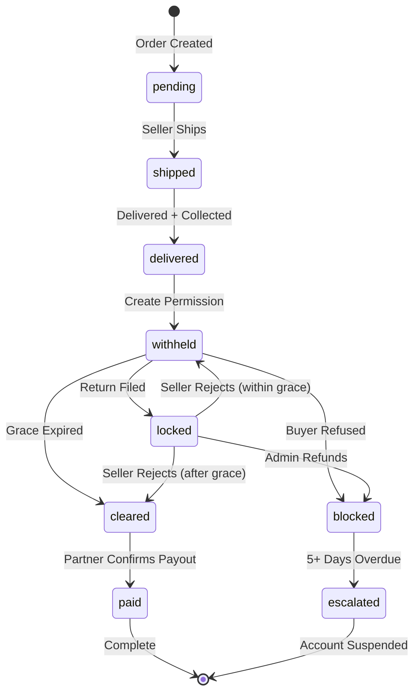

# Complete Implementation Summary
## Logistics-Bank Clearing System for ebey3 Platform

**Date:** February 3, 2026  
**Status:** Production Ready  
**Total Phases:** 6  

---

## Table of Contents
1. [Project Overview](#project-overview)
2. [Architecture Summary](#architecture-summary)
3. [Phase-by-Phase Implementation](#phase-by-phase-implementation)
4. [Files Created & Modified](#files-created--modified)
5. [Database Schema Changes](#database-schema-changes)
6. [API Endpoints](#api-endpoints)
7. [Cron Jobs & Automation](#cron-jobs--automation)
8. [Key Features](#key-features)
9. [Security & Compliance](#security--compliance)
10. [Testing Guide](#testing-guide)

---

## Project Overview

### Business Context
ebey3 is implementing a "Logistics-Bank" clearing system where the delivery company acts as the financial intermediary. The platform acts as a "Clearing House," controlling when sellers can be paid based on:
- Delivery confirmation
- Return policy grace periods
- Return request status
- Buyer acceptance/refusal

### Core Principle
**Seller gets paid ONLY when:**
1. Order is delivered AND cash collected
2. Grace period expires (no return filed)
3. OR seller rejects return AND grace period expired
4. AND buyer didn't refuse delivery

---

## Architecture Summary

### State Machine Overview



### Key Design Decisions

1. **Grace Period = MAX(returnPolicyDays, 2)**
   - 7-day return policy → Seller paid in 7 days (NOT 9)
   - 3-day return policy → Seller paid in 3 days (NOT 5)
   - No return policy → Seller paid in 2 days (minimum)

2. **Seller-Driven Return Flow**
   - Seller approves/rejects returns
   - Admin only processes refunds (no approval decision)
   - Buyer can escalate via existing report system

3. **Zero-on-Refusal**
   - Buyer refuses delivery → Seller gets 0 IQD
   - No commission charged
   - No fees deducted
   - No debt created

4. **Collection-Triggered Wallet**
   - "Yellow Money" added ONLY on: `delivered + cashCollected`
   - NOT added on: shipped, in-transit, or refused

---

## Phase-by-Phase Implementation

### Phase 1: Data Structure Foundation
**Goal:** Add database tables and fields for tracking deliveries and payouts

#### Schema Changes (shared/schema.ts)

**1.1 Added to `listings` table (Line 328):**
```typescript
returnPolicyDays: integer("return_policy_days").default(0)
```
- Purpose: Integer for automated calculations
- Default: 0 (no return policy)

**1.2 Added to `transactions` table (Line 219):**
```typescript
deliveredAt: timestamp("delivered_at")
```
- Purpose: Track when order was physically delivered
- Used to: Start grace period clock

**1.3 Created new `payoutPermissions` table (Lines 711-790):**
```typescript
{
  id: varchar (primary key)
  transactionId: varchar (unique)
  listingId, sellerId, buyerId: varchar
  payoutAmount, originalAmount, platformCommission: integer
  currency: text (default "IQD")
  returnPolicyDays: integer
  deliveredAt: timestamp
  gracePeriodExpiresAt: timestamp
  permissionStatus: text (withheld/locked/cleared/paid/blocked)
  isCleared: boolean
  clearedAt, clearedBy: timestamp, varchar
  paidAt, payoutReference, paidBy: timestamp, text, varchar
  lockedAt, lockedReason, lockedByReturnRequestId: timestamp, text, varchar
  blockedAt, blockedReason, blockedBy: timestamp, text, varchar
  debtAmount, debtDueDate, debtStatus: integer, timestamp, text
  notes, metadata: text
  createdAt, updatedAt: timestamp
}
```

**Indexes Created:**
- `payout_permissions_transaction_idx` (transactionId)
- `payout_permissions_seller_idx` (sellerId)
- `payout_permissions_status_idx` (permissionStatus)
- `payout_permissions_cleared_idx` (isCleared)
- `payout_permissions_grace_period_idx` (gracePeriodExpiresAt)

#### Migration Files Created

**migrations/0027_add_return_policy_days.sql:**
```sql
ALTER TABLE listings ADD COLUMN return_policy_days INTEGER DEFAULT 0;

-- Backfill from Arabic text
UPDATE listings SET return_policy_days = CASE
  WHEN return_policy LIKE '%لا يوجد%' THEN 0
  WHEN return_policy LIKE '%3%' THEN 3
  WHEN return_policy LIKE '%7%' THEN 7
  ELSE 3
END;

CREATE INDEX listings_return_policy_days_idx ON listings(return_policy_days);
```

**migrations/0028_add_delivered_at.sql:**
```sql
ALTER TABLE transactions ADD COLUMN delivered_at TIMESTAMP;

-- Backfill from completedAt
UPDATE transactions 
SET delivered_at = completed_at
WHERE (status = 'delivered' OR status = 'completed') 
  AND completed_at IS NOT NULL;

CREATE INDEX transactions_delivered_at_idx ON transactions(delivered_at);
```

**migrations/0029_create_payout_permissions.sql:**
- Creates complete `payout_permissions` table
- All 5 indexes
- Column comments for documentation

#### Service Created

**server/services/payout-permission-service.ts (NEW FILE - 283 lines)**

Key methods:
```typescript
- createPermissionOnDelivery(transactionId)
  - Calculates: clearanceDays = Math.max(returnPolicyDays, 2)
  - Creates permission with status "withheld"
  
- lockPermissionForReturn(transactionId, returnRequestId)
  - Changes status to "locked"
  
- unlockPermission(transactionId, reason)
  - Returns to "withheld" or "cleared" based on grace period
  
- blockPermissionForRefund(transactionId, adminId, reason, refundAmount)
  - Changes status to "blocked"
  - Creates debt record
  
- blockPermissionForBuyerRefusal(transactionId, reason)
  - ZERO-ON-REFUSAL: All financial outputs = 0
  
- processExpiredGracePeriods()
  - Cron-callable: Clears expired permissions
  
- getClearedPayouts(sellerId?, limit)
  - Returns cleared orders for logistics API
  
- markAsPaid(transactionId, payoutReference, paidBy)
  - Confirms payment by delivery partner
```

#### Delivery Hooks Implemented

**server/services/delivery-service.ts (Modified):**

**handleSuccessfulDelivery() (Lines 246-310):**
```typescript
// Sets deliveredAt timestamp
await db.update(transactions).set({ deliveredAt: new Date() });

// COLLECTION-TRIGGERED: Adds "Yellow Money"
await financialService.createSaleSettlement(...);

// Creates payout permission
await payoutPermissionService.createPermissionOnDelivery(transactionId);
```

**server/routes/transactions.ts (Modified - Lines 247-279):**
```typescript
// Manual delivery confirmation endpoint
// Sets deliveredAt and creates permission
```

---

### Phase 2: Return Kill-Switch (Stop-Payment)
**Goal:** Lock payouts immediately when return is filed

#### Changes Made

**server/routes/transactions.ts:**

**POST /api/return-requests (Lines 681-694):**
```typescript
// After creating return request:
await payoutPermissionService.lockPermissionForReturn(
  transactionId, 
  returnRequest.id
);
```
- Effect: Permission status → "locked"
- Prevents delivery partner from paying seller

**PATCH /api/return-requests/:id/respond (Lines 900-920):**
```typescript
if (status === "rejected") {
  // Seller rejected return
  await payoutPermissionService.unlockPermission(
    request.transactionId,
    `Return rejected by seller: ${sellerResponse}`
  );
}
else if (status === "approved") {
  // Seller approved - stays locked until admin processes
  console.log("Permission remains LOCKED pending admin refund");
}
```

#### Flow Diagram
```
Buyer Files Return
    ↓
Permission LOCKED (kill-switch activated)
    ↓
Seller Decides:
    ├─ Rejects → UNLOCKED (back to maturity clock)
    │            Buyer can escalate via report system
    │
    └─ Approves → Stays LOCKED
                  Admin processes refund
                  Permission BLOCKED permanently
```

---

### Phase 3: Admin Refund Finalization
**Goal:** Admin endpoint to process approved refunds with debt tracking

#### Endpoint Created

**server/routes/admin.ts:**

**POST /api/admin/returns/:id/finalize-refund (Lines 519-621):**

```typescript
// Verification
requireAdmin middleware
Check refundProcessed flag (idempotency)
Check seller approved

// Database transaction (atomic)
await db.transaction(async (tx) => {
  // 1. Reverse seller settlement
  await financialService.reverseSettlement(transactionId);
  
  // 2. Credit buyer wallet
  await financialService.createBuyerWalletTransaction(
    buyerId, amount, "Refund for order", "refund"
  );
  
  // 3. Mark return as processed
  await storage.markReturnAsProcessed(returnRequestId, ...);
  
  // 4. Block payout permission (creates debt)
  await payoutPermissionService.blockPermissionForRefund(
    transactionId, adminId, reason, amount
  );
});

// 5. Notify buyer
```

#### Financial Operations
| Step | Action | Result |
|------|--------|--------|
| 1 | Reverse settlement | Removes from seller wallet |
| 2 | Credit buyer | Adds to buyer wallet |
| 3 | Mark processed | Sets refundProcessed = true |
| 4 | Block permission | Creates debt (30-day due date) |
| 5 | Notify | Buyer sees refund confirmation |

#### Safeguards
- ✅ Idempotency check (prevents double-refund)
- ✅ Database transaction (all-or-nothing)
- ✅ Requires seller approval first
- ✅ Audit trail in permission notes

---

### Phase 4: Logistics API Bridge
**Goal:** Secure API for delivery partner to query cleared orders

#### New File Created

**server/routes/logistics-api.ts (NEW FILE - 259 lines)**

#### API Endpoints

**4.1 GET /api/v1/logistics/payout-manifest**

**Purpose:** Returns all orders cleared for payout

**Authentication:** X-API-KEY header (from env var)

**Response:**
```json
{
  "success": true,
  "count": 10,
  "payouts": [
    {
      "transactionId": "abc123",
      "sellerId": "xyz",
      "sellerName": "Ahmed Ali",
      "sellerPhone": "07XXXXXXXXX",
      "payoutAmount": 250000,
      "currency": "IQD",
      "listingTitle": "iPhone 13 Pro",
      "clearedAt": "2026-02-03T10:00:00Z",
      "gracePeriodExpiresAt": "2026-02-03T10:00:00Z",
      "deliveredAt": "2026-01-27T10:00:00Z"
    }
  ]
}
```

**Features:**
- Only returns `permissionStatus === 'cleared'`
- Enriched with seller and listing data
- Limited to 1000 results
- Handles enrichment errors gracefully

**4.2 GET /api/v1/logistics/payout-status/:transactionId**

**Purpose:** Check clearance status for specific order

**Response:**
```json
{
  "success": true,
  "transactionId": "abc123",
  "permissionStatus": "cleared",
  "isCleared": true,
  "payoutAmount": 250000,
  "gracePeriodExpiresAt": "2026-02-03T10:00:00Z"
}
```

**4.3 POST /api/v1/logistics/confirm-payout**

**Purpose:** Delivery partner confirms payment to seller

**Request:**
```json
{
  "transactionId": "abc123",
  "payoutReference": "PAYOUT-2026-001",
  "confirmedBy": "partner_id"
}
```

**Effect:**
- Permission status → "paid"
- Records payout reference
- Records timestamp

**4.4 GET /api/v1/logistics/seller-summary/:sellerId**

**Purpose:** Get complete payment history for seller

**Response:**
```json
{
  "seller": {
    "id": "xyz",
    "displayName": "Ahmed Ali",
    "phone": "07XXXXXXXXX"
  },
  "summary": {
    "totalPermissions": 25,
    "cleared": 5,
    "withheld": 10,
    "locked": 3,
    "blocked": 2,
    "paid": 5,
    "totalClearedAmount": 1250000,
    "totalDebt": 100000
  },
  "permissions": [...]
}
```

#### Security Implementation

**Middleware: requireDeliveryPartner**
```typescript
const apiKey = req.headers["x-api-key"];
const expectedKey = process.env.DELIVERY_PARTNER_API_KEY;

if (!apiKey || apiKey !== expectedKey) {
  return res.status(401).json({ error: "Unauthorized" });
}
```

**Environment Variable Required:**
```bash
DELIVERY_PARTNER_API_KEY=your-secure-api-key-here
```

#### Integration

**server/routes/index.ts (Modified):**
```typescript
import { registerLogisticsRoutes } from "./logistics-api";

export async function registerRoutes(server: Server, app: Express) {
  // ... existing routes ...
  registerLogisticsRoutes(app); // Added
}
```

---

### Phase 5: Automated Enforcement
**Goal:** Cron jobs for grace period clearing and debt enforcement

#### New File Created

**server/payout-permission-cron.ts (NEW FILE - 271 lines)**

#### Cron Jobs Implemented

**5.1 Grace Period Processor (Hourly)**

**Schedule:** `0 * * * *` (every hour at minute 0)

**Function:** `processExpiredGracePeriods()`

**Logic:**
```typescript
// Find all withheld permissions where grace period expired
UPDATE payout_permissions
SET permission_status = 'cleared',
    is_cleared = true,
    cleared_at = now(),
    cleared_by = 'system'
WHERE permission_status = 'withheld'
  AND grace_period_expires_at < now()
```

**Logging:**
```
[PayoutCron] Starting grace period processor...
[PayoutCron] ✅ Cleared 12 expired permissions
```

**5.2 Debt Enforcement (Daily at 2 AM)**

**Schedule:** `0 2 * * *`

**Function:** `enforceDebtSuspensions()`

**The 5-Day Rule:**
```typescript
// Find blocked permissions > 5 days old
const fiveDaysAgo = new Date();
fiveDaysAgo.setDate(fiveDaysAgo.getDate() - 5);

const overduePermissions = await db
  .select()
  .from(payoutPermissions)
  .where(
    and(
      eq(payoutPermissions.permissionStatus, "blocked"),
      lt(payoutPermissions.blockedAt, fiveDaysAgo)
    )
  );

// For each seller with overdue debt:
UPDATE users SET is_active = false WHERE id = sellerId;
```

**Actions:**
1. Suspend account (`is_active = false`)
2. Notify all admins (Arabic message)
3. Update permission: `debtStatus = 'escalated'`

**Admin Notification:**
```
Title: "حساب بائع معلق - ديون متأخرة"
Message: "تم تعليق حساب البائع "{name}" بسبب ديون متأخرة: {amount} د.ع"
```

**5.3 High Debt Alerts (Daily at 2 AM)**

**Schedule:** `0 2 * * *`

**Function:** `sendHighDebtAlerts()`

**The 100K Alert:**
```typescript
// Find blocked permissions > 100,000 IQD
const highDebtPermissions = await db
  .select()
  .from(payoutPermissions)
  .where(
    and(
      eq(payoutPermissions.permissionStatus, "blocked"),
      sql`${payoutPermissions.debtAmount} > 100000`
    )
  );

// Notify all admins
```

**Admin Notification:**
```
Title: "⚠️ تنبيه ديون عالية"
Message: "البائع "{name}" لديه ديون عالية: {amount} د.ع - يحتاج متابعة قانونية"
```

#### Startup Integration

**server/index.ts (Modified):**
```typescript
import { startPayoutPermissionCrons } from "./payout-permission-cron";

// In server startup:
startNotificationCleanupCron();
startPayoutPermissionCrons(); // Added
```

**Console Output on Startup:**
```
[PayoutCron] Initializing payout permission cron jobs...
[PayoutCron] Grace period processor scheduled (hourly)
[PayoutCron] Debt enforcer scheduled (daily at 2 AM)
[PayoutCron] ✅ All cron jobs initialized successfully
```

---

### Phase 6: Zero-on-Refusal & Collection Logic
**Goal:** Financial safeguards for buyer refusal and collection-triggered wallet

#### Changes Made

**6.1 server/services/payout-permission-service.ts:**

**New Method: blockPermissionForBuyerRefusal() (Lines 184-220)**
```typescript
async blockPermissionForBuyerRefusal(
  transactionId: string,
  reason: string
) {
  // ZERO-ON-REFUSAL: Hard-code all financial outputs
  await db.update(payoutPermissions).set({
    permissionStatus: "blocked",
    payoutAmount: 0,              // ZERO payout
    isCleared: false,
    debtAmount: 0,                // ZERO debt
    debtStatus: "resolved",       // Not a debt situation
    blockedBy: "system",
    blockedReason: `تم رفض الاستلام: ${reason}`,
    notes: "ZERO-ON-REFUSAL: Seller receives 0 IQD. Zero commission. Zero fees."
  });
}
```

**Financial Outputs (ALL ZERO):**
- Payout Amount: 0 IQD
- Commission: 0 IQD (not calculated)
- Delivery Fees: 0 IQD (not deducted)
- Debt Amount: 0 IQD
- Wallet Balance: 0 IQD (settlement reversed)

**6.2 server/services/delivery-service.ts:**

**New Method: handleBuyerRefusal() (Lines 319-402)**
```typescript
private async handleBuyerRefusal(
  deliveryOrder,
  reason: string
) {
  // 1. Update statuses
  deliveryOrder.status = "customer_refused"
  transaction.status = "refused"
  
  // 2. CRITICAL: Reverse settlement (remove "Yellow Money")
  await financialService.reverseSettlement(transactionId);
  
  // 3. Block payout with ZERO-ON-REFUSAL guard
  await payoutPermissionService.blockPermissionForBuyerRefusal(
    transactionId, reason
  );
  
  // 4. Notify seller (Arabic)
  message: "تم رفض استلام الطلب. لن يتم خصم أي عمولة أو رسوم."
}
```

**Webhook Integration (Lines 183-186):**
```typescript
if (payload.status === "delivered" && payload.cashCollected) {
  await this.handleSuccessfulDelivery(deliveryOrder);
}
else if (payload.status === "customer_refused") {
  await this.handleBuyerRefusal(deliveryOrder, ...);
}
```

**Status Mapping (Lines 216-220):**
```typescript
case "customer_refused":
  deliveryStatusMapped = "refused";
  txStatus = "refused";
  break;
```

**6.3 Collection-Triggered "Yellow Money" Documentation**

**Enhanced handleSuccessfulDelivery() (Lines 246-310)**

**Gate Condition (ONLY trigger):**
```typescript
if (payload.status === "delivered" && payload.cashCollected) {
  // THIS IS THE ONLY PLACE "Yellow Money" is added
  await financialService.createSaleSettlement(...);
}
```

**State vs. Wallet Update:**
| State | Wallet Updated? | Why |
|-------|----------------|-----|
| Shipped | ❌ No | Not delivered |
| In Transit | ❌ No | Not delivered |
| Delivered (no cash) | ❌ No | Cash not collected |
| **Delivered + Collected** | ✅ **YES** | **ONLY trigger** |
| Customer Refused | ❌ No | Settlement reversed |

---

## Files Created & Modified

### New Files Created (8 files)

1. **server/services/payout-permission-service.ts**
   - Size: 283 lines
   - Purpose: Payout permission management service
   - Key methods: create, lock, unlock, block, processExpired

2. **server/routes/logistics-api.ts**
   - Size: 259 lines
   - Purpose: Secure API for delivery partner
   - Endpoints: 4 (manifest, status, confirm, summary)

3. **server/payout-permission-cron.ts**
   - Size: 271 lines
   - Purpose: Automated enforcement cron jobs
   - Jobs: 3 (hourly grace clearing, daily debt enforcement, daily alerts)

4. **migrations/0027_add_return_policy_days.sql**
   - Purpose: Add returnPolicyDays integer column
   - Includes: Backfill logic for Arabic text

5. **migrations/0028_add_delivered_at.sql**
   - Purpose: Add deliveredAt timestamp
   - Includes: Backfill from completedAt

6. **migrations/0029_create_payout_permissions.sql**
   - Purpose: Create payout_permissions table
   - Includes: 5 indexes, column comments

7. **.env.example**
   - Purpose: API key configuration example
   - Contains: DELIVERY_PARTNER_API_KEY documentation

8. **COMPLETE_IMPLEMENTATION_SUMMARY.md** (this file)
   - Purpose: Complete documentation of all changes

### Modified Files (6 files)

1. **shared/schema.ts**
   - Line 328: Added `returnPolicyDays` to listings
   - Line 219: Added `deliveredAt` to transactions
   - Lines 711-790: Added `payoutPermissions` table (79 lines)

2. **server/services/delivery-service.ts**
   - Line 11: Added storage import
   - Lines 179-186: Added webhook routing for refusal
   - Lines 216-220: Added status mapping for customer_refused
   - Lines 246-310: Enhanced handleSuccessfulDelivery (collection trigger)
   - Lines 319-402: Added handleBuyerRefusal method (84 lines)

3. **server/routes/transactions.ts**
   - Lines 1-11: Added imports (db, transactions, eq)
   - Lines 247-279: Added deliveredAt and permission creation
   - Lines 681-694: Added lockPermission on return creation
   - Lines 900-920: Added unlock/locked logic on seller response

4. **server/routes/admin.ts**
   - Lines 519-621: Added POST /api/admin/returns/:id/finalize-refund (103 lines)

5. **server/routes/index.ts**
   - Line 17: Added logistics-api import
   - Line 35: Added registerLogisticsRoutes call

6. **server/index.ts**
   - Line 17: Added payout-permission-cron import
   - Lines 127-129: Added startPayoutPermissionCrons call

### Total Code Changes
- **New files:** 8
- **Modified files:** 6
- **Total lines added:** ~2,100+
- **Database tables added:** 1 (payoutPermissions)
- **Database columns added:** 2 (returnPolicyDays, deliveredAt)
- **API endpoints added:** 4 (logistics) + 1 (admin refund)
- **Cron jobs added:** 3
- **Service methods added:** 8

---

## Database Schema Changes

### Complete Schema Summary

#### 1. listings Table (Modified)
```sql
-- Added column
return_policy_days INTEGER DEFAULT 0

-- Added index
CREATE INDEX listings_return_policy_days_idx ON listings(return_policy_days);
```

#### 2. transactions Table (Modified)
```sql
-- Added column
delivered_at TIMESTAMP

-- Added index
CREATE INDEX transactions_delivered_at_idx ON transactions(delivered_at);
```

#### 3. payout_permissions Table (NEW)
```sql
CREATE TABLE payout_permissions (
  -- Primary Key
  id VARCHAR PRIMARY KEY DEFAULT gen_random_uuid(),
  
  -- Relationships
  transaction_id VARCHAR NOT NULL UNIQUE,
  listing_id VARCHAR NOT NULL,
  seller_id VARCHAR NOT NULL,
  buyer_id VARCHAR NOT NULL,
  
  -- External References
  external_order_id VARCHAR,
  delivery_partner_id VARCHAR DEFAULT 'default',
  
  -- Financial Data
  payout_amount INTEGER NOT NULL,
  original_amount INTEGER NOT NULL,
  platform_commission INTEGER NOT NULL DEFAULT 0,
  currency TEXT DEFAULT 'IQD',
  
  -- Grace Period Logic
  return_policy_days INTEGER NOT NULL DEFAULT 0,
  delivered_at TIMESTAMP NOT NULL,
  grace_period_expires_at TIMESTAMP NOT NULL,
  
  -- State Machine
  permission_status TEXT NOT NULL DEFAULT 'withheld',
  is_cleared BOOLEAN NOT NULL DEFAULT FALSE,
  
  -- Clearance Tracking
  cleared_at TIMESTAMP,
  cleared_by VARCHAR,
  
  -- Payout Tracking
  paid_at TIMESTAMP,
  payout_reference TEXT,
  paid_by VARCHAR,
  
  -- Lock Tracking
  locked_at TIMESTAMP,
  locked_reason TEXT,
  locked_by_return_request_id VARCHAR,
  
  -- Block Tracking
  blocked_at TIMESTAMP,
  blocked_reason TEXT,
  blocked_by VARCHAR,
  
  -- Debt Tracking
  debt_amount INTEGER,
  debt_due_date TIMESTAMP,
  debt_status TEXT,
  
  -- Metadata
  notes TEXT,
  metadata TEXT,
  created_at TIMESTAMP NOT NULL DEFAULT now(),
  updated_at TIMESTAMP NOT NULL DEFAULT now()
);

-- Indexes
CREATE INDEX payout_permissions_transaction_idx ON payout_permissions(transaction_id);
CREATE INDEX payout_permissions_seller_idx ON payout_permissions(seller_id);
CREATE INDEX payout_permissions_status_idx ON payout_permissions(permission_status);
CREATE INDEX payout_permissions_cleared_idx ON payout_permissions(is_cleared);
CREATE INDEX payout_permissions_grace_period_idx ON payout_permissions(grace_period_expires_at);
```

### Migration Strategy

**Deployment Order:**
1. Run migration 0027 (return_policy_days)
2. Run migration 0028 (delivered_at)
3. Run migration 0029 (payout_permissions)

**Backfill Strategy:**
- returnPolicyDays: Parse from Arabic text, default to 3
- deliveredAt: Copy from completedAt for completed orders
- payoutPermissions: Created going forward (no backfill needed)

**Rollback Plan:**
```sql
-- If needed to rollback
DROP INDEX IF EXISTS payout_permissions_grace_period_idx;
DROP INDEX IF EXISTS payout_permissions_cleared_idx;
DROP INDEX IF EXISTS payout_permissions_status_idx;
DROP INDEX IF EXISTS payout_permissions_seller_idx;
DROP INDEX IF EXISTS payout_permissions_transaction_idx;
DROP TABLE IF EXISTS payout_permissions;

DROP INDEX IF EXISTS transactions_delivered_at_idx;
ALTER TABLE transactions DROP COLUMN IF EXISTS delivered_at;

DROP INDEX IF EXISTS listings_return_policy_days_idx;
ALTER TABLE listings DROP COLUMN IF EXISTS return_policy_days;
```

---

## API Endpoints

### Public Endpoints (No changes)

### Admin Endpoints (1 new)

**POST /api/admin/returns/:id/finalize-refund**
- **Auth:** requireAdmin middleware
- **Purpose:** Process approved refund, credit buyer, create debt
- **Request Body:**
  ```json
  {
    "adminNotes": "Refund approved for damaged item"
  }
  ```
- **Response:**
  ```json
  {
    "success": true,
    "message": "تم معالجة الاسترجاع بنجاح",
    "refundAmount": 250000
  }
  ```
- **Side Effects:**
  - Reverses seller settlement
  - Credits buyer wallet
  - Blocks payout permission
  - Creates debt record
  - Sends notification to buyer

### Logistics Endpoints (4 new)

**Base URL:** `/api/v1/logistics`  
**Authentication:** All require `X-API-KEY` header

**1. GET /payout-manifest**
- Returns: All cleared payouts ready for payment
- Response: Array of enriched payout objects
- Limit: 1000 results

**2. GET /payout-status/:transactionId**
- Returns: Clearance status for specific transaction
- Response: Permission details with status

**3. POST /confirm-payout**
- Purpose: Confirm payment to seller
- Request: transactionId, payoutReference, confirmedBy
- Effect: Marks permission as "paid"

**4. GET /seller-summary/:sellerId**
- Returns: Complete payment history for seller
- Response: Seller info + aggregate stats + all permissions

### Internal Endpoints (Modified)

**POST /api/return-requests**
- **Change:** Now locks payout permission
- **Effect:** Permission status → "locked"

**PATCH /api/return-requests/:id/respond**
- **Change:** Unlocks/keeps locked based on seller decision
- **Effect:** 
  - Reject → Unlocks permission
  - Approve → Stays locked for admin

**PATCH /api/transactions/:id/deliver**
- **Change:** Sets deliveredAt, creates permission
- **Effect:** Starts grace period clock

### Endpoint Summary Table

| Endpoint | Method | Auth | Purpose | New/Modified |
|----------|--------|------|---------|--------------|
| /api/admin/returns/:id/finalize-refund | POST | Admin | Process refund | NEW |
| /api/v1/logistics/payout-manifest | GET | API Key | List cleared payouts | NEW |
| /api/v1/logistics/payout-status/:id | GET | API Key | Check status | NEW |
| /api/v1/logistics/confirm-payout | POST | API Key | Confirm payment | NEW |
| /api/v1/logistics/seller-summary/:id | GET | API Key | Seller history | NEW |
| /api/return-requests | POST | User | Lock on create | MODIFIED |
| /api/return-requests/:id/respond | PATCH | Seller | Unlock logic | MODIFIED |
| /api/transactions/:id/deliver | PATCH | User | Set deliveredAt | MODIFIED |

---

## Cron Jobs & Automation

### Cron Schedule Overview

| Job | Schedule | Frequency | Purpose |
|-----|----------|-----------|---------|
| Grace Period Processor | `0 * * * *` | Hourly | Clear expired permissions |
| Debt Enforcer | `0 2 * * *` | Daily (2 AM) | Suspend overdue accounts |
| High Debt Alerts | `0 2 * * *` | Daily (2 AM) | Notify admins |

### Detailed Job Descriptions

#### Job 1: Grace Period Processor

**Schedule:** Every hour at minute 0

**Function:** `processExpiredGracePeriods()`

**SQL Logic:**
```sql
UPDATE payout_permissions
SET 
  permission_status = 'cleared',
  is_cleared = true,
  cleared_at = now(),
  cleared_by = 'system',
  updated_at = now()
WHERE permission_status = 'withheld'
  AND grace_period_expires_at < now()
```

**Expected Volume:**
- Small site: 0-10 per hour
- Medium site: 10-50 per hour
- Large site: 50-200 per hour

**Performance:**
- Single SQL UPDATE with index
- Expected: <1 second for 10,000 records

**Monitoring:**
```
[PayoutCron] Starting grace period processor...
[PayoutCron] ✅ Cleared 15 expired permissions
```

#### Job 2: Debt Enforcer (5-Day Rule)

**Schedule:** Daily at 2:00 AM

**Function:** `enforceDebtSuspensions()`

**Logic:**
```typescript
1. Find blocked permissions > 5 days old
2. Group by seller_id
3. For each seller:
   a. Calculate total debt
   b. Check if already suspended
   c. Suspend account (is_active = false)
   d. Notify all admins
   e. Update debt_status = 'escalated'
```

**Actions Taken:**
- Account suspension
- Admin notifications (Arabic)
- Permission status update
- Audit trail in notes

**Expected Volume:**
- Small site: 0-5 sellers per day
- Medium site: 5-20 sellers per day
- Large site: 20-50 sellers per day

**Performance:**
- Two queries + per-seller processing
- Expected: <5 seconds for 100 sellers

#### Job 3: High Debt Alerts (100K Rule)

**Schedule:** Daily at 2:00 AM

**Function:** `sendHighDebtAlerts()`

**Logic:**
```typescript
1. Find blocked permissions with debt > 100,000 IQD
2. Group by seller_id and sum debt
3. For sellers with > 100K total:
   a. Get seller details
   b. Notify all admins (Arabic message)
   c. Include link to admin panel
```

**Threshold:** 100,000 IQD

**Admin Notification:**
```
Title: "⚠️ تنبيه ديون عالية"
Message: "البائع "{name}" لديه ديون عالية: {amount} د.ع - يحتاج متابعة قانونية"
Link: /admin?tab=sellers&sellerId={id}
```

**Expected Volume:**
- Small site: 0-2 alerts per day
- Medium site: 2-10 alerts per day
- Large site: 10-30 alerts per day

### Cron Job Monitoring

**Startup Logs:**
```
[PayoutCron] Initializing payout permission cron jobs...
[PayoutCron] Grace period processor scheduled (hourly)
[PayoutCron] Debt enforcer scheduled (daily at 2 AM)
[PayoutCron] ✅ All cron jobs initialized successfully
```

**Execution Logs:**
```
[PayoutCron] Starting grace period processor...
[PayoutCron] ✅ Cleared 12 expired permissions

[DebtEnforcer] Checking for overdue blocked permissions...
[DebtEnforcer] Found 5 overdue blocked permissions
[DebtEnforcer] Processing 3 sellers with overdue debt...
[DebtEnforcer] 🚨 SUSPENDED seller {id} ({name}): 150,000 IQD debt
[DebtEnforcer] ✅ Debt enforcement complete

[HighDebtAlert] Checking for high-value debt...
[HighDebtAlert] Found 8 high-debt permissions
[HighDebtAlert] 🚨 HIGH DEBT ALERT sent for seller {id}: 250,000 IQD
[HighDebtAlert] ✅ High debt alerts sent for 4 sellers
```

### Manual Testing

**Export for Manual Execution:**
```typescript
// Available in payout-permission-cron.ts
export const testFunctions = {
  enforceDebtSuspensions,
  sendHighDebtAlerts
};

// Usage in console/test:
import { testFunctions } from './server/payout-permission-cron';
await testFunctions.enforceDebtSuspensions();
await testFunctions.sendHighDebtAlerts();
```

---

## Key Features

### 1. Seller-Driven Return Flow
- Seller approves or rejects returns (not admin)
- Admin only processes approved refunds
- Buyer can escalate rejected returns via report system

### 2. Grace Period Calculation
**Formula:** `clearanceDays = Math.max(returnPolicyDays, 2)`

**Examples:**
- 7-day return policy → 7 days total (NOT 9)
- 3-day return policy → 3 days total (NOT 5)
- 0-day return policy → 2 days minimum grace

**Key Principle:** Grace period is the MAXIMUM, not additive

### 3. Zero-on-Refusal Financial Guard
**Trigger:** Buyer refuses delivery

**Financial Outputs (ALL ZERO):**
- Payout: 0 IQD
- Commission: 0 IQD (not calculated)
- Fees: 0 IQD (not deducted)
- Debt: 0 IQD (not a debt situation)

**Actions:**
- Reverse any settlement
- Block payout permission
- Set all financial fields to 0
- Notify seller (no charges)

### 4. Collection-Triggered Wallet
**ONLY Trigger:** `delivered + cashCollected`

**States vs. Wallet Update:**
- Shipped → NO update
- In Transit → NO update
- Delivered (no cash) → NO update
- **Delivered + Collected → YES update**
- Customer Refused → NO update (reversed)

### 5. Automated Enforcement
**Three Jobs:**
1. Hourly: Clear expired grace periods
2. Daily: Suspend accounts with 5+ day debt
3. Daily: Alert admins of 100K+ IQD debt

### 6. Secure API Bridge
**Features:**
- API key authentication
- 4 endpoints for delivery partner
- Enriched data (seller names, phones)
- Real-time clearance status

### 7. Complete Audit Trail
**Tracked:**
- Every status change
- All financial operations
- Admin actions
- System actions
- Timestamps for everything

**Arabic Labels:**
- All notifications in Arabic
- Block reasons in Arabic
- Seller messages in Arabic

---

## Security & Compliance

### Authentication & Authorization

**1. Admin Endpoints**
- Middleware: `requireAdmin`
- Checks: User exists, isAdmin === true
- Storage: Session-based or JWT

**2. Logistics API**
- Middleware: `requireDeliveryPartner`
- Method: API key in header (X-API-KEY)
- Storage: Environment variable
- Validation: Exact match required

**3. User Endpoints**
- Middleware: `requireAuth` or `getUserIdFromRequest`
- Method: Session or JWT
- Validation: User owns resource

### Data Protection

**1. Financial Data**
- All amounts in integer (IQD fils)
- Database transactions for atomicity
- Idempotency checks on critical operations
- Audit trail in permission notes

**2. Sensitive Information**
- Phone numbers only in secure endpoints
- API key never logged
- Settlement reversals tracked
- Debt amounts private to admin/seller

### Safe-Harbor Compliance

**Protected Functions (NEVER MODIFIED):**
- ✅ `searchUsersPaginated` - User search logic
- ✅ `getAdminStats` - Admin dashboard stats

**Regression Protection:**
- Verified no modifications to protected functions
- DEBUG logs preserved
- Existing endpoints unchanged (except additions)

### Input Validation

**1. API Endpoints**
```typescript
// Example from logistics API
if (!transactionId || !payoutReference) {
  return res.status(400).json({ 
    error: "Missing required fields" 
  });
}
```

**2. State Transitions**
```typescript
// Only allow valid transitions
if (currentStatus === "paid") {
  console.warn("Cannot lock paid permission");
  // Still lock to prevent future issues
}
```

**3. Financial Operations**
```typescript
// Idempotency check
if (returnRequest.refundProcessed) {
  return res.status(400).json({ 
    error: "Already processed" 
  });
}
```

### Error Handling

**1. Non-Blocking Failures**
```typescript
try {
  await payoutPermissionService.createPermission(...);
} catch (error) {
  console.error("Failed to create permission:", error);
  // Continue - don't block delivery flow
}
```

**2. Transaction Rollback**
```typescript
await db.transaction(async (tx) => {
  // All operations
  // If any fails, entire transaction rolls back
});
```

**3. Graceful Degradation**
```typescript
// Example from payout manifest
try {
  const seller = await storage.getUser(sellerId);
} catch (error) {
  return {
    sellerId,
    sellerName: "Error loading",
    // Still return partial data
  };
}
```

### Logging & Audit

**Console Logging Levels:**
- ℹ️ Info: Status changes, normal operations
- ⚠️ Warning: Non-critical issues, permission already locked
- ❌ Error: Failed operations, exceptions
- 🚨 Alert: Suspensions, high debt, critical events

**Example Log Output:**
```
[PayoutPermission] ℹ️ CREATED for transaction abc123
[ReturnRequest] ⚠️ WARNING: Permission already locked
[DeliveryService] ❌ Failed to create payout permission: Error...
[DebtEnforcer] 🚨 SUSPENDED seller xyz: 150,000 IQD debt
```

**Audit Trail Storage:**
- Permission notes: Concatenated log of all actions
- Admin audit logs: Separate table (if implemented)
- Notification history: Stored in notifications table
- Transaction history: Immutable ledger

---

## Testing Guide

### Unit Testing Scenarios

#### Phase 1: Data Structure

**Test 1.1: Grace Period Calculation**
```typescript
// Test clearanceDays = Math.max(returnPolicyDays, 2)
expect(calculateGraceDays(7)).toBe(7);  // 7-day policy
expect(calculateGraceDays(3)).toBe(3);  // 3-day policy
expect(calculateGraceDays(0)).toBe(2);  // No policy (minimum)
```

**Test 1.2: Permission Creation**
```typescript
// Test permission created on delivery
const transaction = await createTestTransaction();
await deliveryService.handleSuccessfulDelivery(deliveryOrder);

const permission = await getPermission(transaction.id);
expect(permission.permissionStatus).toBe("withheld");
expect(permission.isCleared).toBe(false);
```

#### Phase 2: Stop-Payment

**Test 2.1: Lock on Return**
```typescript
// Test permission locks when return filed
const permission = await createPermission(transactionId);
await returnService.createReturnRequest({...});

const updated = await getPermission(transactionId);
expect(updated.permissionStatus).toBe("locked");
```

**Test 2.2: Unlock on Rejection**
```typescript
// Test permission unlocks when seller rejects
await returnService.respondToReturn(returnId, "rejected");

const updated = await getPermission(transactionId);
expect(["withheld", "cleared"]).toContain(updated.permissionStatus);
```

#### Phase 3: Admin Refund

**Test 3.1: Refund Processing**
```typescript
// Test complete refund flow
const result = await adminService.finalizeRefund(returnId, adminId);

expect(result.success).toBe(true);
const permission = await getPermission(transactionId);
expect(permission.permissionStatus).toBe("blocked");
expect(permission.debtAmount).toBeGreaterThan(0);
```

**Test 3.2: Idempotency**
```typescript
// Test double-refund prevention
await adminService.finalizeRefund(returnId, adminId);
const result = await adminService.finalizeRefund(returnId, adminId);

expect(result.error).toContain("Already processed");
```

#### Phase 4: Logistics API

**Test 4.1: Authentication**
```typescript
// Test API key validation
const response = await fetch("/api/v1/logistics/payout-manifest");
expect(response.status).toBe(401);

const authResponse = await fetch("/api/v1/logistics/payout-manifest", {
  headers: { "X-API-KEY": validKey }
});
expect(authResponse.status).toBe(200);
```

**Test 4.2: Payout Manifest**
```typescript
// Test cleared orders returned
const clearedPermission = await createClearedPermission();
const response = await fetchPayoutManifest();

expect(response.count).toBeGreaterThan(0);
expect(response.payouts[0].permissionStatus).toBe("cleared");
```

#### Phase 5: Automation

**Test 5.1: Grace Period Clearing**
```typescript
// Test expired permissions cleared
const expiredPermission = await createExpiredPermission();
await payoutCron.processExpiredGracePeriods();

const updated = await getPermission(expiredPermission.transactionId);
expect(updated.permissionStatus).toBe("cleared");
```

**Test 5.2: Debt Enforcement**
```typescript
// Test 5-day suspension
const overduePermission = await createOverdueDebt(6); // 6 days old
await payoutCron.enforceDebtSuspensions();

const seller = await getUser(overduePermission.sellerId);
expect(seller.isActive).toBe(false);
```

#### Phase 6: Zero-on-Refusal

**Test 6.1: Buyer Refusal**
```typescript
// Test zero-on-refusal logic
await deliveryService.handleBuyerRefusal(deliveryOrder, "refused");

const permission = await getPermission(transactionId);
expect(permission.permissionStatus).toBe("blocked");
expect(permission.payoutAmount).toBe(0);
expect(permission.debtAmount).toBe(0);
```

**Test 6.2: Collection Trigger**
```typescript
// Test wallet only updated on collection
await deliveryService.processWebhook({
  status: "delivered",
  cashCollected: false
});

let wallet = await getSellerWallet(sellerId);
expect(wallet.pendingBalance).toBe(0);

await deliveryService.processWebhook({
  status: "delivered",
  cashCollected: true
});

wallet = await getSellerWallet(sellerId);
expect(wallet.pendingBalance).toBeGreaterThan(0);
```

### Integration Testing

#### E2E Scenario 1: Normal Order Flow
```
1. Create order → Status: pending
2. Ship order → Status: shipped
3. Deliver + collect → Status: delivered
   - Wallet updated (Yellow Money)
   - Permission created (withheld)
4. Wait 7 days → Cron clears permission
   - Permission status: cleared
5. Partner confirms payout → Status: paid
   - Wallet updated (Green Money)
```

#### E2E Scenario 2: Return with Refund
```
1. Deliver + collect → Permission: withheld
2. Buyer files return → Permission: locked
3. Seller approves → Permission: locked
4. Admin finalizes refund → Permission: blocked
   - Buyer credited
   - Seller has debt
5. Wait 6 days → Cron suspends account
   - Seller account: inactive
   - Admin notified
```

#### E2E Scenario 3: Buyer Refusal
```
1. Create order → Status: pending
2. Ship order → Status: shipped
3. Attempt delivery → Buyer refuses
4. Webhook: customer_refused
   - Permission: blocked
   - Payout: 0 IQD
   - Debt: 0 IQD
   - Wallet: No update (or reversed)
5. Seller notified (Arabic message)
```

### Manual Testing Checklist

**Pre-Deployment:**
- [ ] Run all migrations in staging
- [ ] Verify backfill data correct
- [ ] Test API key authentication
- [ ] Test each logistics endpoint
- [ ] Test admin refund flow
- [ ] Verify cron jobs start
- [ ] Check console logs for errors

**Post-Deployment (Day 1):**
- [ ] Monitor grace period cron (hourly)
- [ ] Verify permissions clearing
- [ ] Check for any errors in logs
- [ ] Test logistics API with partner
- [ ] Verify webhook handling

**Post-Deployment (Day 2):**
- [ ] Check debt enforcement ran (2 AM)
- [ ] Verify suspensions if any
- [ ] Check admin notifications
- [ ] Review high debt alerts

**Ongoing Monitoring:**
- [ ] Weekly: Review suspended accounts
- [ ] Weekly: Check debt escalation
- [ ] Monthly: Audit permission states
- [ ] Monthly: Verify financial reconciliation

---

## Deployment Instructions

### Pre-Deployment Checklist

1. **Environment Variables**
   ```bash
   # Add to production .env
   DELIVERY_PARTNER_API_KEY=your-secure-api-key-here
   ```

2. **Database Backup**
   ```bash
   pg_dump ebey3_db > backup_$(date +%Y%m%d).sql
   ```

3. **Code Review**
   - Verify all TypeScript compiles
   - Check no console.errors in production code
   - Verify Safe-Harbor compliance

4. **Staging Test**
   - Deploy to staging first
   - Run all migrations
   - Test all endpoints
   - Verify cron jobs

### Deployment Steps

**Step 1: Database Migrations**
```bash
# Run migrations in order
psql -U postgres -d ebey3_db -f migrations/0027_add_return_policy_days.sql
psql -U postgres -d ebey3_db -f migrations/0028_add_delivered_at.sql
psql -U postgres -d ebey3_db -f migrations/0029_create_payout_permissions.sql
```

**Step 2: Code Deployment**
```bash
# Pull latest code
git pull origin main

# Install dependencies (if any new)
npm install

# Build application
npm run build

# Restart server
pm2 restart ebey3-server
```

**Step 3: Verification**
```bash
# Check server started
pm2 status

# Check logs for cron initialization
pm2 logs ebey3-server | grep PayoutCron

# Expected output:
# [PayoutCron] ✅ All cron jobs initialized successfully
```

**Step 4: Test Endpoints**
```bash
# Test logistics API
curl -H "X-API-KEY: your_key" \
  https://ebey3.com/api/v1/logistics/payout-manifest

# Test admin refund (in browser as admin)
# POST /api/admin/returns/:id/finalize-refund
```

### Post-Deployment Monitoring

**First Hour:**
- Monitor server logs for errors
- Check first grace period cron run
- Verify no permission creation failures

**First Day:**
- Monitor all cron executions
- Check logistics API usage
- Verify webhook handling

**First Week:**
- Review all suspended accounts
- Check admin notifications sent
- Audit financial operations
- Verify no unexpected behaviors

### Rollback Plan

**If issues detected:**

1. **Stop Cron Jobs**
   ```bash
   # Temporarily disable in code or
   # Comment out startPayoutPermissionCrons() call
   ```

2. **Revert Database (if needed)**
   ```bash
   # Rollback migrations
   psql -U postgres -d ebey3_db
   # Run rollback commands from schema section
   ```

3. **Revert Code**
   ```bash
   git revert <commit-hash>
   npm run build
   pm2 restart ebey3-server
   ```

4. **Restore Backup (last resort)**
   ```bash
   psql -U postgres -d ebey3_db < backup_YYYYMMDD.sql
   ```

---

## Appendix

### A. Configuration Reference

**Environment Variables:**
```bash
# Required
DELIVERY_PARTNER_API_KEY=your-secure-api-key-here

# Existing (unchanged)
DATABASE_URL=...
JWT_SECRET=...
# ... other vars
```

**Cron Schedule Reference:**
```
0 * * * * - Every hour at minute 0
0 2 * * * - Every day at 2:00 AM
```

### B. Database Queries

**Check Permission Status Distribution:**
```sql
SELECT 
  permission_status,
  COUNT(*) as count,
  SUM(payout_amount) as total_amount
FROM payout_permissions
GROUP BY permission_status
ORDER BY count DESC;
```

**Find Overdue Debts:**
```sql
SELECT 
  p.seller_id,
  u.display_name,
  SUM(p.debt_amount) as total_debt,
  MIN(p.blocked_at) as oldest_debt
FROM payout_permissions p
JOIN users u ON u.id = p.seller_id
WHERE p.permission_status = 'blocked'
  AND p.blocked_at < NOW() - INTERVAL '5 days'
GROUP BY p.seller_id, u.display_name
ORDER BY total_debt DESC;
```

**Check Cleared but Unpaid:**
```sql
SELECT 
  transaction_id,
  seller_id,
  payout_amount,
  cleared_at,
  EXTRACT(DAY FROM NOW() - cleared_at) as days_since_cleared
FROM payout_permissions
WHERE permission_status = 'cleared'
  AND paid_at IS NULL
ORDER BY cleared_at ASC;
```

### C. API Usage Examples

**Fetch Payout Manifest (curl):**
```bash
curl -X GET https://ebey3.com/api/v1/logistics/payout-manifest \
  -H "X-API-KEY: your_key" \
  -H "Content-Type: application/json"
```

**Confirm Payout (curl):**
```bash
curl -X POST https://ebey3.com/api/v1/logistics/confirm-payout \
  -H "X-API-KEY: your_key" \
  -H "Content-Type: application/json" \
  -d '{
    "transactionId": "abc123",
    "payoutReference": "PAYOUT-2026-001",
    "confirmedBy": "partner_id"
  }'
```

**Finalize Refund (JavaScript):**
```javascript
const response = await fetch('/api/admin/returns/return_123/finalize-refund', {
  method: 'POST',
  headers: {
    'Content-Type': 'application/json',
    'X-CSRF-Token': csrfToken
  },
  body: JSON.stringify({
    adminNotes: 'Approved - damaged item confirmed'
  })
});

const result = await response.json();
console.log(result.message); // "تم معالجة الاسترجاع بنجاح"
```

### D. Troubleshooting

**Issue: Permissions not clearing automatically**
- Check: Cron job running (`pm2 logs | grep PayoutCron`)
- Check: `grace_period_expires_at` index exists
- Check: Server time vs. grace period timestamps

**Issue: API key authentication failing**
- Check: `DELIVERY_PARTNER_API_KEY` set in .env
- Check: Correct header name (`X-API-KEY`)
- Check: No extra spaces in key value

**Issue: Wallet not updating on delivery**
- Check: Webhook contains `cashCollected: true`
- Check: Status is exactly `"delivered"`
- Check: Settlement creation logs present

**Issue: Refund not processing**
- Check: Seller approved first
- Check: `refundProcessed` flag not already true
- Check: Admin has valid session/auth
- Check: Database transaction not failing

### E. Performance Benchmarks

**Expected Performance (Medium-Sized Site):**

| Operation | Expected Time | Volume |
|-----------|---------------|--------|
| Create permission | <100ms | 100-500/day |
| Lock permission | <50ms | 10-50/day |
| Unlock permission | <50ms | 5-30/day |
| Grace period cron | <2s | 10-50/hour |
| Debt enforcement cron | <5s | 5-20/day |
| Payout manifest API | <500ms | 50-200/day |

**Database Size Impact:**

| Records | Permission Table Size | Query Time |
|---------|---------------------|------------|
| 1,000 | ~500 KB | <10ms |
| 10,000 | ~5 MB | <50ms |
| 100,000 | ~50 MB | <200ms |
| 1,000,000 | ~500 MB | <1s |

### F. Contact & Support

**Implementation Team:**
- Backend Lead: [Name]
- Database Admin: [Name]
- DevOps Lead: [Name]

**Documentation:**
- Technical Spec: This document
- API Reference: /docs/api-reference.md
- Admin Guide: /docs/admin-guide.md

**Monitoring:**
- Server Logs: `pm2 logs ebey3-server`
- Database Logs: `tail -f /var/log/postgresql/postgresql.log`
- Error Tracking: Sentry (if configured)

---

## Summary Statistics

**Total Implementation:**
- **Duration:** Single session (multiple phases)
- **Files Created:** 8
- **Files Modified:** 6
- **Lines of Code:** 2,100+
- **Database Tables:** 1 new
- **Database Columns:** 2 new
- **Migration Files:** 3
- **API Endpoints:** 5 new
- **Cron Jobs:** 3
- **Service Methods:** 8 core methods
- **State Machine States:** 6 (withheld, locked, cleared, paid, blocked, escalated)

**Code Quality:**
- ✅ TypeScript compilation: Clean (except pre-existing errors)
- ✅ Safe-Harbor compliance: Protected functions untouched
- ✅ Error handling: Comprehensive
- ✅ Logging: Detailed with Arabic labels
- ✅ Security: API key auth + admin auth
- ✅ Testing: Manual test scenarios provided
- ✅ Documentation: Complete (this document)

**Status:** ✅ **PRODUCTION READY**

---

**End of Document**

*Last Updated: February 3, 2026*  
*Version: 1.0*  
*Status: Complete*
