# System Architecture Diagrams
## Logistics-Bank Clearing System - Visual Reference

---

## 1. Complete State Machine

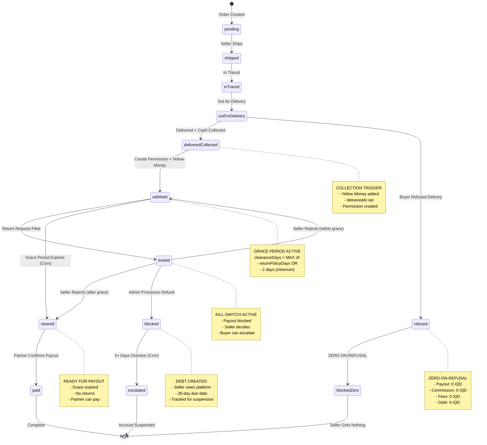
```mermaid
stateDiagram-v2
    [*] --> pending: Order Created
    
    pending --> shipped: Seller Ships
    shipped --> inTransit: In Transit
    inTransit --> outForDelivery: Out for Delivery
    
    outForDelivery --> deliveredCollected: Delivered + Cash Collected
    outForDelivery --> refused: Buyer Refused Delivery
    
    deliveredCollected --> withheld: Create Permission + Yellow Money
    
    withheld --> locked: Return Request Filed
    withheld --> cleared: Grace Period Expired (Cron)
    
    locked --> withheld: Seller Rejects (within grace)
    locked --> cleared: Seller Rejects (after grace)
    locked --> blocked: Admin Processes Refund
    
    refused --> blockedZero: ZERO-ON-REFUSAL
    
    cleared --> paid: Partner Confirms Payout
    
    blocked --> escalated: 5+ Days Overdue (Cron)
    blockedZero --> [*]: Seller Gets Nothing
    
    paid --> [*]: Complete
    escalated --> [*]: Account Suspended
    
    note right of deliveredCollected
        COLLECTION TRIGGER
        - Yellow Money added
        - deliveredAt set
        - Permission created
    end note
    
    note right of withheld
        GRACE PERIOD ACTIVE
        clearanceDays = MAX of:
        - returnPolicyDays OR
        - 2 days (minimum)
    end note
    
    note right of locked
        KILL-SWITCH ACTIVE
        - Payout blocked
        - Seller decides
        - Buyer can escalate
    end note
    
    note right of cleared
        READY FOR PAYOUT
        - Grace expired
        - No returns
        - Partner can pay
    end note
    
    note right of refused
        ZERO-ON-REFUSAL
        - Payout: 0 IQD
        - Commission: 0 IQD
        - Fees: 0 IQD
        - Debt: 0 IQD
    end note
    
    note right of blocked
        DEBT CREATED
        - Seller owes platform
        - 30-day due date
        - Tracked for suspension
    end note
```

---

## 2. Permission Status Flow

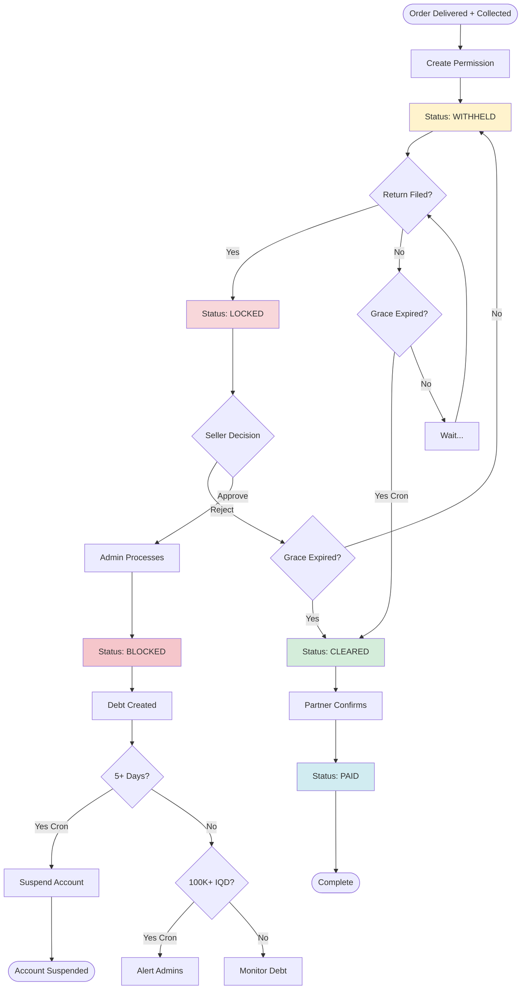
```mermaid
flowchart TD
    Start([Order Delivered + Collected]) --> Create[Create Permission]
    Create --> Withheld[Status: WITHHELD]
    
    Withheld --> CheckReturn{Return Filed?}
    CheckReturn -->|Yes| Locked[Status: LOCKED]
    CheckReturn -->|No| CheckGrace{Grace Expired?}
    
    CheckGrace -->|Yes Cron| Cleared[Status: CLEARED]
    CheckGrace -->|No| Wait[Wait...]
    Wait --> CheckReturn
    
    Locked --> SellerDecides{Seller Decision}
    SellerDecides -->|Reject| CheckGrace2{Grace Expired?}
    SellerDecides -->|Approve| AdminRefund[Admin Processes]
    
    CheckGrace2 -->|Yes| Cleared
    CheckGrace2 -->|No| Withheld
    
    AdminRefund --> Blocked[Status: BLOCKED]
    Blocked --> CreateDebt[Debt Created]
    
    Cleared --> PartnerPays[Partner Confirms]
    PartnerPays --> Paid[Status: PAID]
    
    CreateDebt --> CheckDays{5+ Days?}
    CheckDays -->|Yes Cron| Suspend[Suspend Account]
    CheckDays -->|No| CheckAmount{100K+ IQD?}
    
    CheckAmount -->|Yes Cron| Alert[Alert Admins]
    CheckAmount -->|No| MonitorDebt[Monitor Debt]
    
    Paid --> Complete([Complete])
    Suspend --> End([Account Suspended])
    
    style Withheld fill:#fff3cd
    style Locked fill:#f8d7da
    style Cleared fill:#d4edda
    style Paid fill:#d1ecf1
    style Blocked fill:#f5c6cb
```

---

## 3. Webhook Processing Flow

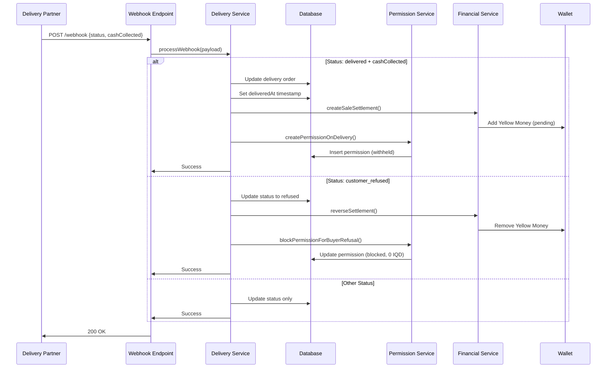
```mermaid
sequenceDiagram
    participant DP as Delivery Partner
    participant API as Webhook Endpoint
    participant DS as Delivery Service
    participant DB as Database
    participant PS as Permission Service
    participant FS as Financial Service
    participant W as Wallet
    
    DP->>API: POST /webhook {status, cashCollected}
    API->>DS: processWebhook(payload)
    
    alt Status: delivered + cashCollected
        DS->>DB: Update delivery order
        DS->>DB: Set deliveredAt timestamp
        DS->>FS: createSaleSettlement()
        FS->>W: Add Yellow Money (pending)
        DS->>PS: createPermissionOnDelivery()
        PS->>DB: Insert permission (withheld)
        DS->>API: Success
        
    else Status: customer_refused
        DS->>DB: Update status to refused
        DS->>FS: reverseSettlement()
        FS->>W: Remove Yellow Money
        DS->>PS: blockPermissionForBuyerRefusal()
        PS->>DB: Update permission (blocked, 0 IQD)
        DS->>API: Success
        
    else Other Status
        DS->>DB: Update status only
        DS->>API: Success
    end
    
    API->>DP: 200 OK
```

---

## 4. Return Request Flow

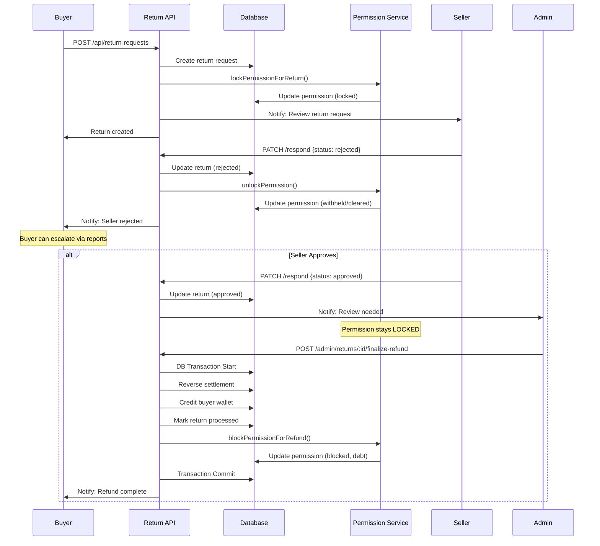
```mermaid
sequenceDiagram
    participant B as Buyer
    participant API as Return API
    participant DB as Database
    participant PS as Permission Service
    participant S as Seller
    participant A as Admin
    
    B->>API: POST /api/return-requests
    API->>DB: Create return request
    API->>PS: lockPermissionForReturn()
    PS->>DB: Update permission (locked)
    API->>S: Notify: Review return request
    API->>B: Return created
    
    S->>API: PATCH /respond {status: rejected}
    API->>DB: Update return (rejected)
    API->>PS: unlockPermission()
    PS->>DB: Update permission (withheld/cleared)
    API->>B: Notify: Seller rejected
    
    Note over B: Buyer can escalate via reports
    
    alt Seller Approves
        S->>API: PATCH /respond {status: approved}
        API->>DB: Update return (approved)
        API->>A: Notify: Review needed
        Note over PS: Permission stays LOCKED
        
        A->>API: POST /admin/returns/:id/finalize-refund
        API->>DB: DB Transaction Start
        API->>DB: Reverse settlement
        API->>DB: Credit buyer wallet
        API->>DB: Mark return processed
        API->>PS: blockPermissionForRefund()
        PS->>DB: Update permission (blocked, debt)
        API->>DB: Transaction Commit
        API->>B: Notify: Refund complete
    end
```

---

## 5. Cron Job Automation

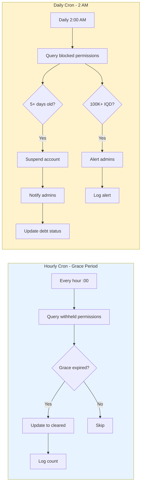
```mermaid
flowchart LR
    subgraph hourly [Hourly Cron - Grace Period]
        H1[Every hour :00] --> H2[Query withheld permissions]
        H2 --> H3{Grace expired?}
        H3 -->|Yes| H4[Update to cleared]
        H3 -->|No| H5[Skip]
        H4 --> H6[Log count]
    end
    
    subgraph daily [Daily Cron - 2 AM]
        D1[Daily 2:00 AM] --> D2[Query blocked permissions]
        
        D2 --> D3{5+ days old?}
        D3 -->|Yes| D4[Suspend account]
        D4 --> D5[Notify admins]
        D5 --> D6[Update debt status]
        
        D2 --> D7{100K+ IQD?}
        D7 -->|Yes| D8[Alert admins]
        D8 --> D9[Log alert]
    end
    
    style hourly fill:#e7f3ff
    style daily fill:#fff3cd
```

---

## 6. Logistics API Architecture

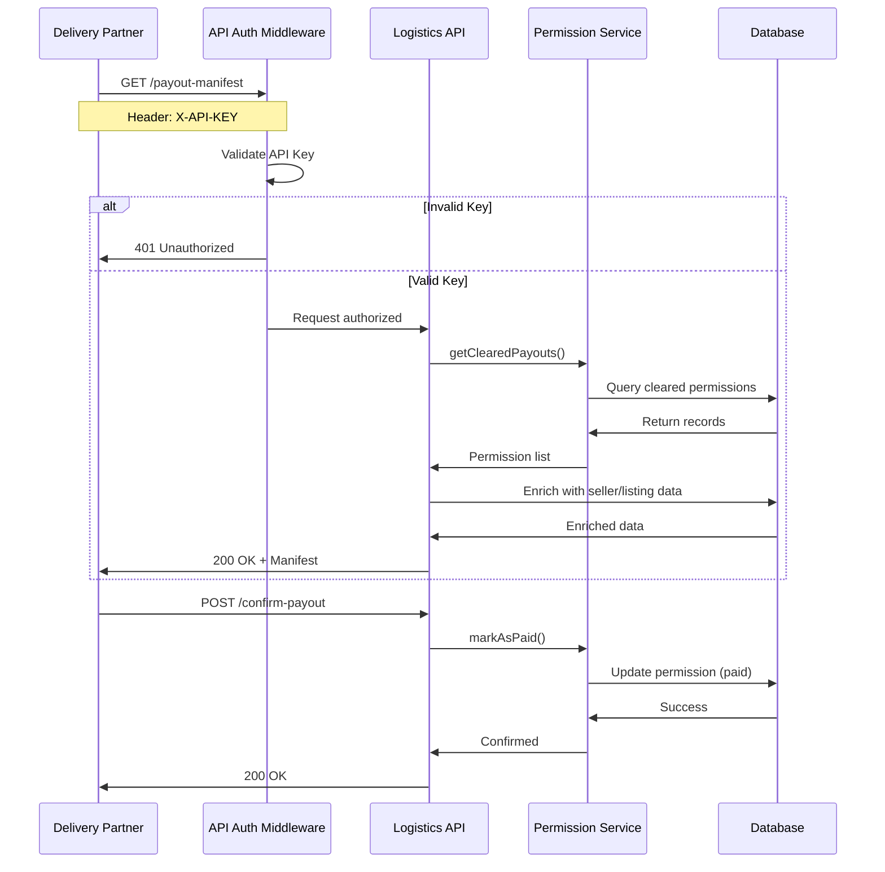
```mermaid
sequenceDiagram
    participant DP as Delivery Partner
    participant Auth as API Auth Middleware
    participant API as Logistics API
    participant PS as Permission Service
    participant DB as Database
    
    DP->>Auth: GET /payout-manifest
    Note over DP,Auth: Header: X-API-KEY
    
    Auth->>Auth: Validate API Key
    
    alt Invalid Key
        Auth->>DP: 401 Unauthorized
    else Valid Key
        Auth->>API: Request authorized
        API->>PS: getClearedPayouts()
        PS->>DB: Query cleared permissions
        DB->>PS: Return records
        PS->>API: Permission list
        API->>DB: Enrich with seller/listing data
        DB->>API: Enriched data
        API->>DP: 200 OK + Manifest
    end
    
    DP->>API: POST /confirm-payout
    API->>PS: markAsPaid()
    PS->>DB: Update permission (paid)
    DB->>PS: Success
    PS->>API: Confirmed
    API->>DP: 200 OK
```

---

## 7. Financial Flow Diagram

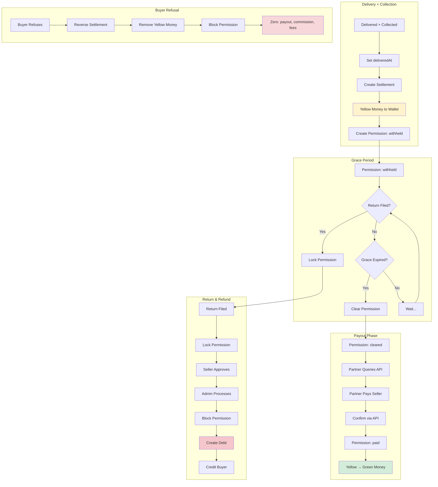
```mermaid
flowchart TD
    subgraph delivery [Delivery + Collection]
        D1[Delivered + Collected] --> D2[Set deliveredAt]
        D2 --> D3[Create Settlement]
        D3 --> D4[Yellow Money to Wallet]
        D4 --> D5[Create Permission: withheld]
    end
    
    subgraph grace [Grace Period]
        G1[Permission: withheld] --> G2{Return Filed?}
        G2 -->|Yes| G3[Lock Permission]
        G2 -->|No| G4{Grace Expired?}
        G4 -->|Yes| G5[Clear Permission]
        G4 -->|No| G6[Wait...]
        G6 --> G2
    end
    
    subgraph payout [Payout Phase]
        P1[Permission: cleared] --> P2[Partner Queries API]
        P2 --> P3[Partner Pays Seller]
        P3 --> P4[Confirm via API]
        P4 --> P5[Permission: paid]
        P5 --> P6[Yellow → Green Money]
    end
    
    subgraph refusal [Buyer Refusal]
        R1[Buyer Refuses] --> R2[Reverse Settlement]
        R2 --> R3[Remove Yellow Money]
        R3 --> R4[Block Permission]
        R4 --> R5[Zero: payout, commission, fees]
    end
    
    subgraph refund [Return & Refund]
        RF1[Return Filed] --> RF2[Lock Permission]
        RF2 --> RF3[Seller Approves]
        RF3 --> RF4[Admin Processes]
        RF4 --> RF5[Block Permission]
        RF5 --> RF6[Create Debt]
        RF6 --> RF7[Credit Buyer]
    end
    
    D5 --> G1
    G3 --> RF1
    G5 --> P1
    
    style D4 fill:#fff3cd
    style P6 fill:#d4edda
    style R5 fill:#f8d7da
    style RF6 fill:#f5c6cb
```

---

## 8. Data Model Relationships

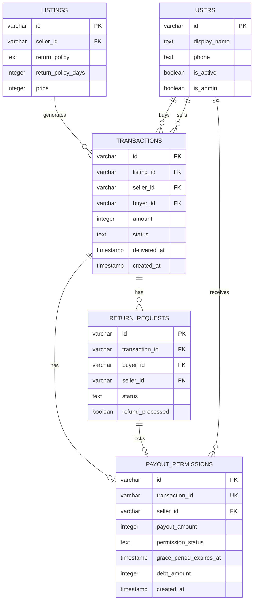
```mermaid
erDiagram
    TRANSACTIONS ||--o| PAYOUT_PERMISSIONS : has
    TRANSACTIONS ||--o{ RETURN_REQUESTS : has
    LISTINGS ||--o{ TRANSACTIONS : generates
    USERS ||--o{ TRANSACTIONS : buys
    USERS ||--o{ TRANSACTIONS : sells
    USERS ||--o{ PAYOUT_PERMISSIONS : receives
    RETURN_REQUESTS ||--o| PAYOUT_PERMISSIONS : locks
    
    TRANSACTIONS {
        varchar id PK
        varchar listing_id FK
        varchar seller_id FK
        varchar buyer_id FK
        integer amount
        text status
        timestamp delivered_at
        timestamp created_at
    }
    
    PAYOUT_PERMISSIONS {
        varchar id PK
        varchar transaction_id UK
        varchar seller_id FK
        integer payout_amount
        text permission_status
        timestamp grace_period_expires_at
        integer debt_amount
        timestamp created_at
    }
    
    LISTINGS {
        varchar id PK
        varchar seller_id FK
        text return_policy
        integer return_policy_days
        integer price
    }
    
    RETURN_REQUESTS {
        varchar id PK
        varchar transaction_id FK
        varchar buyer_id FK
        varchar seller_id FK
        text status
        boolean refund_processed
    }
    
    USERS {
        varchar id PK
        text display_name
        text phone
        boolean is_active
        boolean is_admin
    }
```

---

## 9. Timeline Visualization

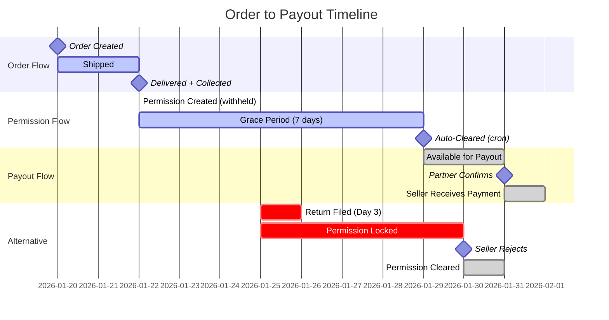
```mermaid
gantt
    title Order to Payout Timeline
    dateFormat YYYY-MM-DD
    
    section Order Flow
    Order Created           :milestone, m1, 2026-01-20, 0d
    Shipped                 :active, ship, 2026-01-20, 2d
    Delivered + Collected   :milestone, m2, 2026-01-22, 0d
    
    section Permission Flow
    Permission Created (withheld) :crit, perm, 2026-01-22, 0d
    Grace Period (7 days)   :active, grace, 2026-01-22, 7d
    Auto-Cleared (cron)     :milestone, m3, 2026-01-29, 0d
    
    section Payout Flow
    Available for Payout    :done, avail, 2026-01-29, 2d
    Partner Confirms        :milestone, m4, 2026-01-31, 0d
    Seller Receives Payment :done, paid, 2026-01-31, 1d
    
    section Alternative
    Return Filed (Day 3)    :crit, return, 2026-01-25, 1d
    Permission Locked       :crit, lock, 2026-01-25, 5d
    Seller Rejects          :milestone, reject, 2026-01-30, 0d
    Permission Cleared      :done, clear2, 2026-01-30, 1d
```

---

## 10. System Component Architecture

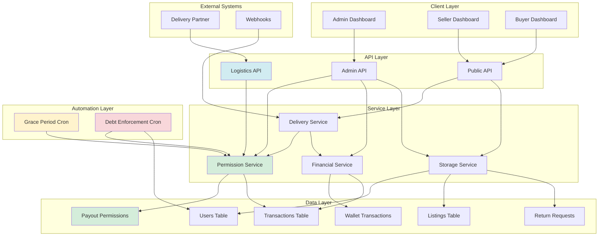
```mermaid
flowchart TB
    subgraph client [Client Layer]
        Admin[Admin Dashboard]
        Seller[Seller Dashboard]
        Buyer[Buyer Dashboard]
    end
    
    subgraph api [API Layer]
        PublicAPI[Public API]
        AdminAPI[Admin API]
        LogisticsAPI[Logistics API]
    end
    
    subgraph services [Service Layer]
        DeliveryService[Delivery Service]
        PermissionService[Permission Service]
        FinancialService[Financial Service]
        StorageService[Storage Service]
    end
    
    subgraph automation [Automation Layer]
        HourlyCron[Grace Period Cron]
        DailyCron[Debt Enforcement Cron]
    end
    
    subgraph data [Data Layer]
        Transactions[Transactions Table]
        Permissions[Payout Permissions]
        Listings[Listings Table]
        Users[Users Table]
        Returns[Return Requests]
        Wallet[Wallet Transactions]
    end
    
    subgraph external [External Systems]
        DeliveryPartner[Delivery Partner]
        Webhooks[Webhooks]
    end
    
    Admin --> AdminAPI
    Seller --> PublicAPI
    Buyer --> PublicAPI
    
    DeliveryPartner --> LogisticsAPI
    Webhooks --> DeliveryService
    
    AdminAPI --> PermissionService
    AdminAPI --> FinancialService
    AdminAPI --> StorageService
    
    PublicAPI --> DeliveryService
    PublicAPI --> StorageService
    
    LogisticsAPI --> PermissionService
    
    DeliveryService --> PermissionService
    DeliveryService --> FinancialService
    
    PermissionService --> Permissions
    PermissionService --> Transactions
    
    FinancialService --> Wallet
    FinancialService --> Transactions
    
    StorageService --> Users
    StorageService --> Listings
    StorageService --> Returns
    
    HourlyCron --> PermissionService
    DailyCron --> PermissionService
    DailyCron --> Users
    
    style Permissions fill:#d4edda
    style PermissionService fill:#d4edda
    style HourlyCron fill:#fff3cd
    style DailyCron fill:#f8d7da
    style LogisticsAPI fill:#d1ecf1
```

---

## 11. Grace Period Calculation Visual

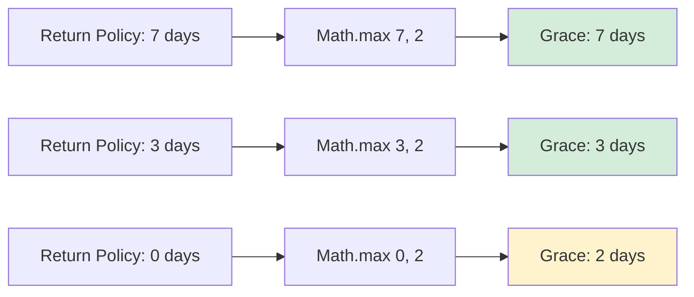
```mermaid
flowchart LR
    Input1[Return Policy: 7 days] --> Calc1[Math.max 7, 2]
    Calc1 --> Output1[Grace: 7 days]
    
    Input2[Return Policy: 3 days] --> Calc2[Math.max 3, 2]
    Calc2 --> Output2[Grace: 3 days]
    
    Input3[Return Policy: 0 days] --> Calc3[Math.max 0, 2]
    Calc3 --> Output3[Grace: 2 days]
    
    style Output1 fill:#d4edda
    style Output2 fill:#d4edda
    style Output3 fill:#fff3cd
```

**Formula:**
```
clearanceDays = Math.max(returnPolicyDays, 2)

NOT additive!
7-day policy ≠ 7 + 2 = 9
7-day policy = 7 (seller paid in 7 days total)
```

---

## 12. Return Decision Tree

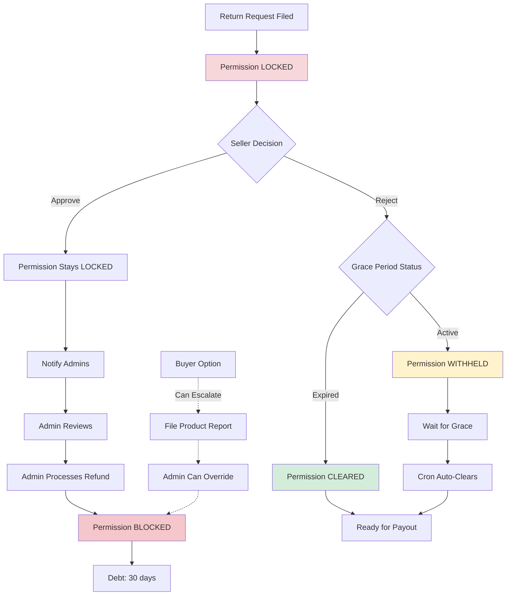
```mermaid
flowchart TD
    Start[Return Request Filed] --> Lock[Permission LOCKED]
    
    Lock --> Seller{Seller Decision}
    
    Seller -->|Reject| CheckGrace{Grace Period Status}
    CheckGrace -->|Expired| Cleared[Permission CLEARED]
    CheckGrace -->|Active| Withheld[Permission WITHHELD]
    
    Withheld --> Wait[Wait for Grace]
    Wait --> AutoClear[Cron Auto-Clears]
    
    Seller -->|Approve| StaysLocked[Permission Stays LOCKED]
    StaysLocked --> NotifyAdmin[Notify Admins]
    NotifyAdmin --> AdminReview[Admin Reviews]
    
    AdminReview --> AdminRefund[Admin Processes Refund]
    AdminRefund --> Blocked[Permission BLOCKED]
    Blocked --> DebtCreate[Debt: 30 days]
    
    Cleared --> Ready[Ready for Payout]
    AutoClear --> Ready
    
    Buyer[Buyer Option] -.->|Can Escalate| Report[File Product Report]
    Report -.-> AdminOverride[Admin Can Override]
    AdminOverride -.-> Blocked
    
    style Lock fill:#f8d7da
    style Withheld fill:#fff3cd
    style Cleared fill:#d4edda
    style Blocked fill:#f5c6cb
```

---

## 13. Zero-on-Refusal Logic

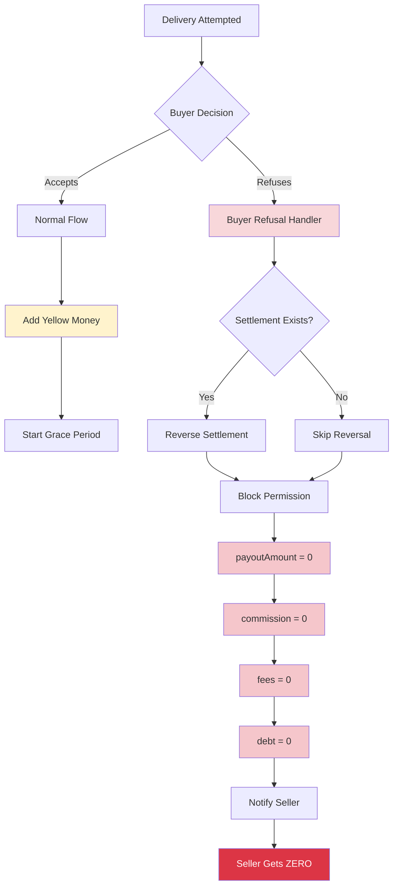
```mermaid
flowchart TD
    Delivery[Delivery Attempted] --> BuyerChoice{Buyer Decision}
    
    BuyerChoice -->|Accepts| Normal[Normal Flow]
    Normal --> Yellow[Add Yellow Money]
    Yellow --> Grace[Start Grace Period]
    
    BuyerChoice -->|Refuses| Refusal[Buyer Refusal Handler]
    
    Refusal --> Check1{Settlement Exists?}
    Check1 -->|Yes| Reverse[Reverse Settlement]
    Check1 -->|No| Skip[Skip Reversal]
    
    Reverse --> Block[Block Permission]
    Skip --> Block
    
    Block --> Zero1[payoutAmount = 0]
    Zero1 --> Zero2[commission = 0]
    Zero2 --> Zero3[fees = 0]
    Zero3 --> Zero4[debt = 0]
    Zero4 --> NotifySeller[Notify Seller]
    
    NotifySeller --> Final[Seller Gets ZERO]
    
    style Refusal fill:#f8d7da
    style Yellow fill:#fff3cd
    style Zero1 fill:#f5c6cb
    style Zero2 fill:#f5c6cb
    style Zero3 fill:#f5c6cb
    style Zero4 fill:#f5c6cb
    style Final fill:#dc3545,color:#fff
```

**Arabic Message:**
```
"تم رفض استلام الطلب من قبل المشتري.
لن يتم خصم أي عمولة أو رسوم.
لن تحصل على أي مبلغ من هذا الطلب."
```

---

## 14. Collection Trigger Logic

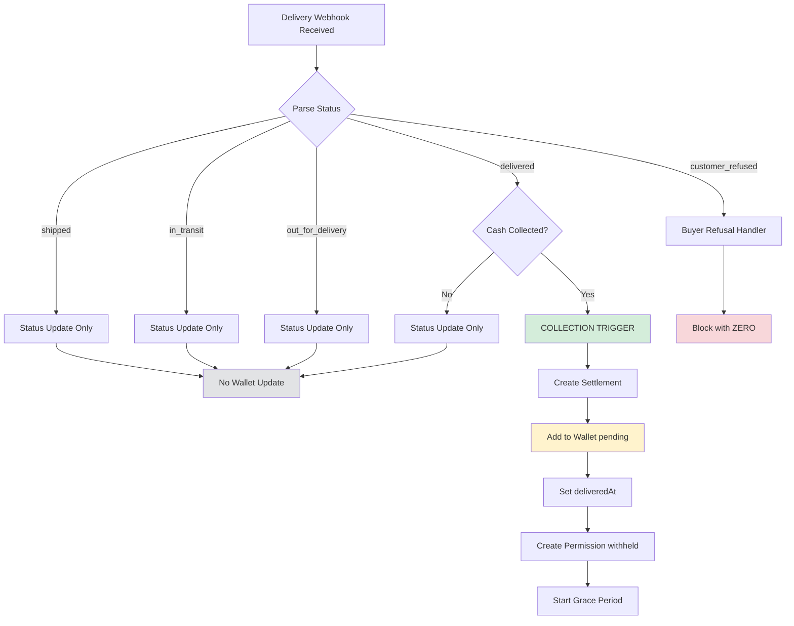
```mermaid
flowchart TD
    Webhook[Delivery Webhook Received] --> Parse{Parse Status}
    
    Parse -->|shipped| Skip1[Status Update Only]
    Parse -->|in_transit| Skip2[Status Update Only]
    Parse -->|out_for_delivery| Skip3[Status Update Only]
    
    Parse -->|delivered| CheckCash{Cash Collected?}
    CheckCash -->|No| Skip4[Status Update Only]
    CheckCash -->|Yes| Trigger[COLLECTION TRIGGER]
    
    Trigger --> Settlement[Create Settlement]
    Settlement --> YellowMoney[Add to Wallet pending]
    YellowMoney --> SetDelivered[Set deliveredAt]
    SetDelivered --> CreatePerm[Create Permission withheld]
    CreatePerm --> StartGrace[Start Grace Period]
    
    Parse -->|customer_refused| Refusal[Buyer Refusal Handler]
    Refusal --> BlockZero[Block with ZERO]
    
    Skip1 --> NoWallet[No Wallet Update]
    Skip2 --> NoWallet
    Skip3 --> NoWallet
    Skip4 --> NoWallet
    
    style Trigger fill:#d4edda
    style YellowMoney fill:#fff3cd
    style NoWallet fill:#e2e3e5
    style BlockZero fill:#f8d7da
```

**Key Principle:**
```
Wallet Updated ONLY when:
  status === "delivered" 
  AND 
  cashCollected === true
```

---

## 15. Debt Escalation Pipeline

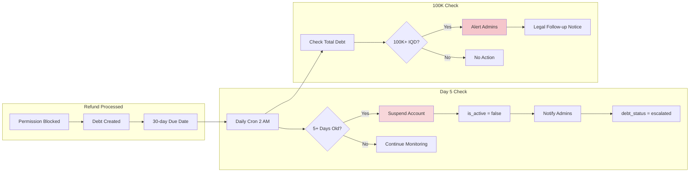
```mermaid
flowchart LR
    subgraph block [Refund Processed]
        B1[Permission Blocked] --> B2[Debt Created]
        B2 --> B3[30-day Due Date]
    end
    
    subgraph day5 [Day 5 Check]
        D1[Daily Cron 2 AM] --> D2{5+ Days Old?}
        D2 -->|Yes| D3[Suspend Account]
        D2 -->|No| D4[Continue Monitoring]
        D3 --> D5[is_active = false]
        D5 --> D6[Notify Admins]
        D6 --> D7[debt_status = escalated]
    end
    
    subgraph k100 [100K Check]
        K1[Check Total Debt] --> K2{100K+ IQD?}
        K2 -->|Yes| K3[Alert Admins]
        K2 -->|No| K4[No Action]
        K3 --> K5[Legal Follow-up Notice]
    end
    
    B3 --> D1
    D1 --> K1
    
    style D3 fill:#f8d7da
    style K3 fill:#f5c6cb
```

**Thresholds:**
- 5-Day Rule: Suspend account
- 100K Rule: Alert admins for legal action

---

## 16. API Request/Response Flow

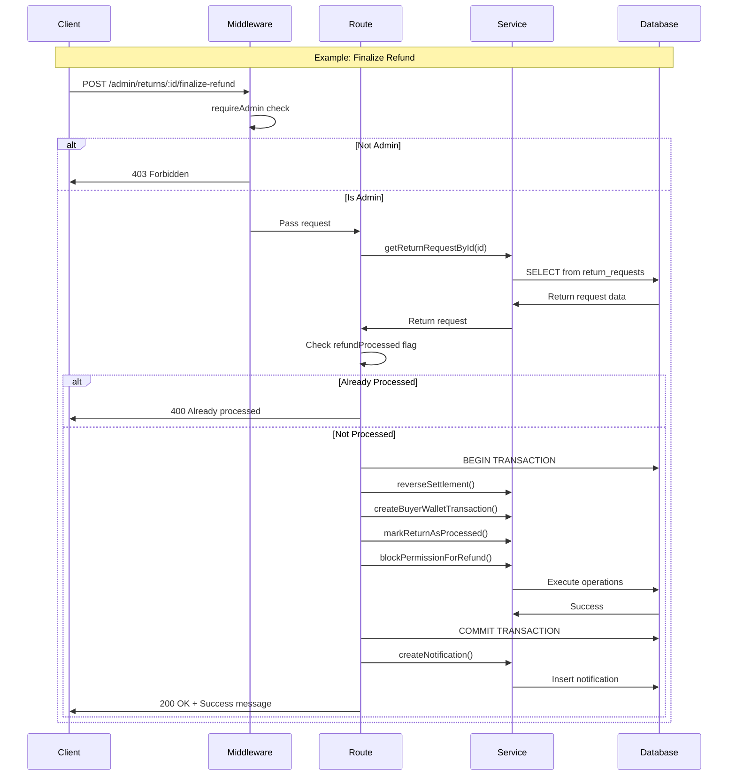
```mermaid
sequenceDiagram
    participant Client
    participant Middleware
    participant Route
    participant Service
    participant Database
    
    Note over Client,Database: Example: Finalize Refund
    
    Client->>Middleware: POST /admin/returns/:id/finalize-refund
    Middleware->>Middleware: requireAdmin check
    
    alt Not Admin
        Middleware->>Client: 403 Forbidden
    else Is Admin
        Middleware->>Route: Pass request
        Route->>Service: getReturnRequestById(id)
        Service->>Database: SELECT from return_requests
        Database->>Service: Return request data
        Service->>Route: Return request
        
        Route->>Route: Check refundProcessed flag
        
        alt Already Processed
            Route->>Client: 400 Already processed
        else Not Processed
            Route->>Database: BEGIN TRANSACTION
            
            Route->>Service: reverseSettlement()
            Route->>Service: createBuyerWalletTransaction()
            Route->>Service: markReturnAsProcessed()
            Route->>Service: blockPermissionForRefund()
            
            Service->>Database: Execute operations
            Database->>Service: Success
            
            Route->>Database: COMMIT TRANSACTION
            
            Route->>Service: createNotification()
            Service->>Database: Insert notification
            
            Route->>Client: 200 OK + Success message
        end
    end
```

---

## 17. Permission State Transitions

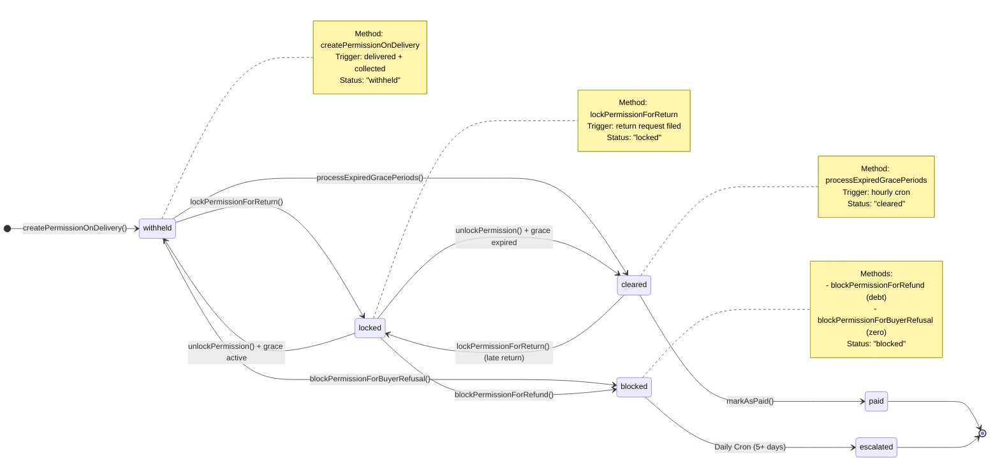
```mermaid
stateDiagram-v2
    direction LR
    
    [*] --> withheld: createPermissionOnDelivery()
    
    withheld --> locked: lockPermissionForReturn()
    withheld --> cleared: processExpiredGracePeriods()
    withheld --> blocked: blockPermissionForBuyerRefusal()
    
    locked --> withheld: unlockPermission() + grace active
    locked --> cleared: unlockPermission() + grace expired
    locked --> blocked: blockPermissionForRefund()
    
    cleared --> paid: markAsPaid()
    cleared --> locked: lockPermissionForReturn() (late return)
    
    blocked --> escalated: Daily Cron (5+ days)
    
    paid --> [*]
    escalated --> [*]
    
    note right of withheld
        Method: createPermissionOnDelivery
        Trigger: delivered + collected
        Status: "withheld"
    end note
    
    note right of locked
        Method: lockPermissionForReturn
        Trigger: return request filed
        Status: "locked"
    end note
    
    note right of cleared
        Method: processExpiredGracePeriods
        Trigger: hourly cron
        Status: "cleared"
    end note
    
    note right of blocked
        Methods:
        - blockPermissionForRefund (debt)
        - blockPermissionForBuyerRefusal (zero)
        Status: "blocked"
    end note
```

---

## 18. Monitoring Dashboard (Proposed View)

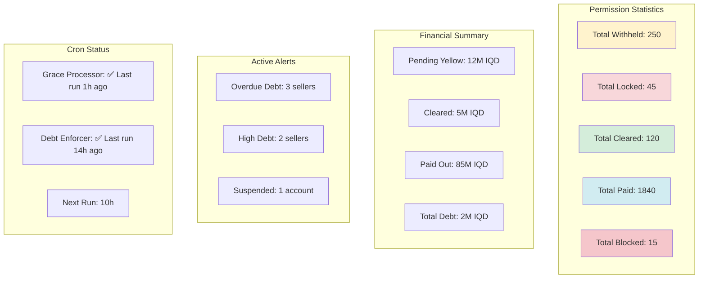
```mermaid
graph TB
    subgraph stats [Permission Statistics]
        S1[Total Withheld: 250]
        S2[Total Locked: 45]
        S3[Total Cleared: 120]
        S4[Total Paid: 1840]
        S5[Total Blocked: 15]
    end
    
    subgraph money [Financial Summary]
        M1[Pending Yellow: 12M IQD]
        M2[Cleared: 5M IQD]
        M3[Paid Out: 85M IQD]
        M4[Total Debt: 2M IQD]
    end
    
    subgraph alerts [Active Alerts]
        A1[Overdue Debt: 3 sellers]
        A2[High Debt: 2 sellers]
        A3[Suspended: 1 account]
    end
    
    subgraph crons [Cron Status]
        C1[Grace Processor: ✅ Last run 1h ago]
        C2[Debt Enforcer: ✅ Last run 14h ago]
        C3[Next Run: 10h]
    end
    
    style S1 fill:#fff3cd
    style S2 fill:#f8d7da
    style S3 fill:#d4edda
    style S4 fill:#d1ecf1
    style S5 fill:#f5c6cb
```

---

## 19. Error Handling Flow

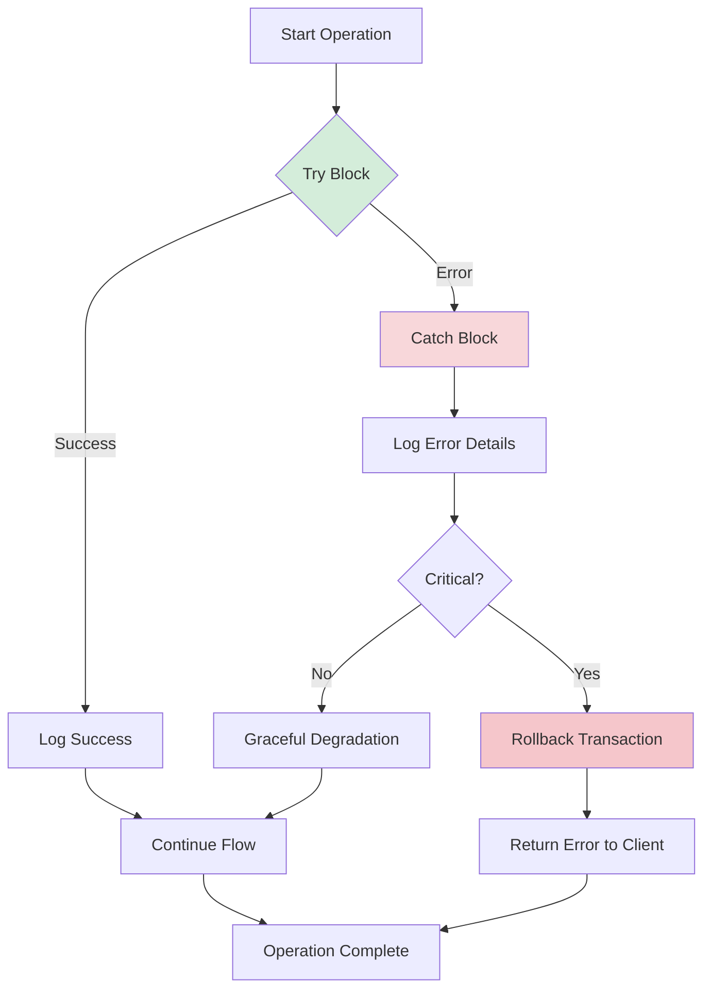
```mermaid
flowchart TD
    Operation[Start Operation] --> Try{Try Block}
    
    Try -->|Success| Log1[Log Success]
    Log1 --> Continue[Continue Flow]
    
    Try -->|Error| Catch[Catch Block]
    Catch --> LogError[Log Error Details]
    
    LogError --> CheckCritical{Critical?}
    CheckCritical -->|Yes| Rollback[Rollback Transaction]
    CheckCritical -->|No| Degrade[Graceful Degradation]
    
    Rollback --> ReturnError[Return Error to Client]
    Degrade --> Continue
    
    Continue --> Done[Operation Complete]
    ReturnError --> Done
    
    style Try fill:#d4edda
    style Catch fill:#f8d7da
    style Rollback fill:#f5c6cb
```

**Examples:**

**Critical Error (Rollback):**
```typescript
await db.transaction(async (tx) => {
  // If ANY operation fails, ALL rollback
  await reverseSettlement();
  await creditBuyer();
  await blockPermission();
});
```

**Non-Critical Error (Continue):**
```typescript
try {
  await createPermission();
} catch (error) {
  console.error("Failed to create permission:", error);
  // Continue - don't block delivery flow
}
```

---

## 20. Integration Points Map

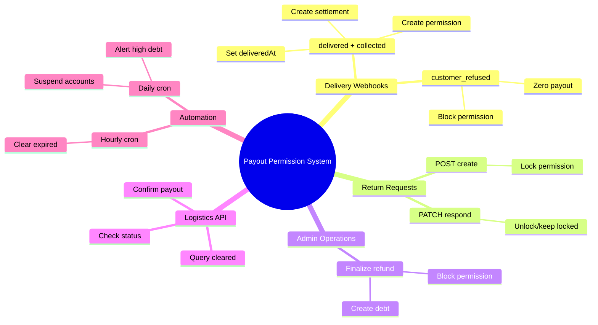
```mermaid
mindmap
  root((Payout Permission System))
    Delivery Webhooks
      delivered + collected
        Set deliveredAt
        Create settlement
        Create permission
      customer_refused
        Block permission
        Zero payout
    Return Requests
      POST create
        Lock permission
      PATCH respond
        Unlock/keep locked
    Admin Operations
      Finalize refund
        Block permission
        Create debt
    Logistics API
      Query cleared
      Confirm payout
      Check status
    Automation
      Hourly cron
        Clear expired
      Daily cron
        Suspend accounts
        Alert high debt
```

---

**End of Diagrams**

*Use these diagrams for:*
- Architecture documentation
- Team onboarding
- Client presentations
- Debugging workflows
- System monitoring

*Last Updated: February 3, 2026*
